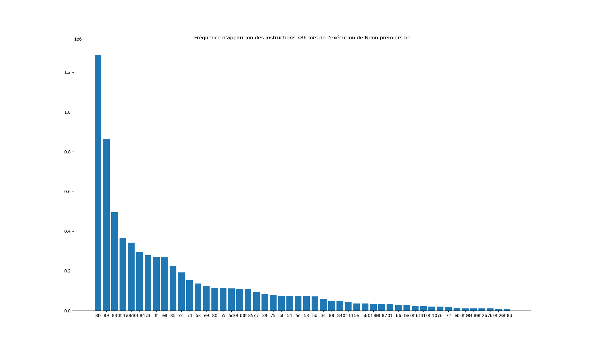
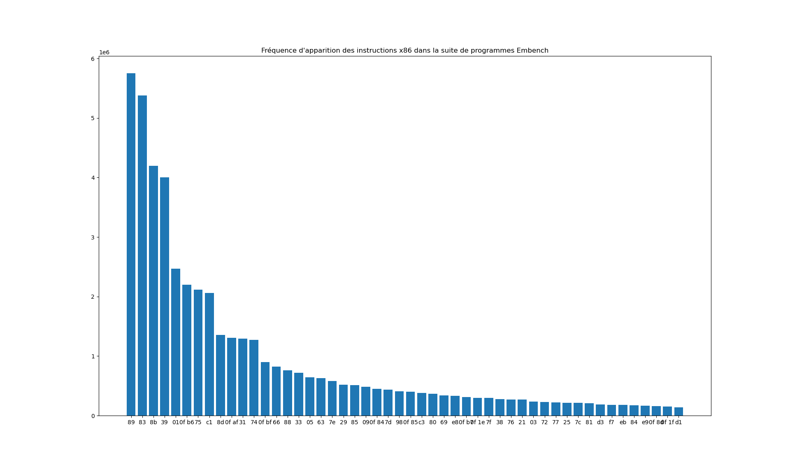
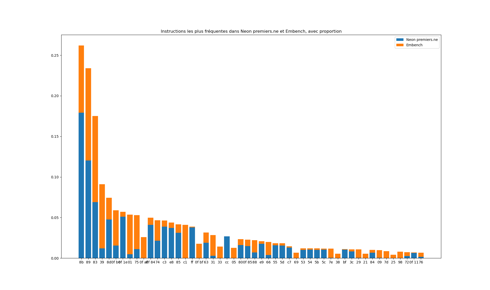

# Stage traduction dynamique de binaires x86 vers RISC-V

## I - Les solutions de traduction dynamique de binaires déjà existantes : Box64 et QEMU

Box64 est un traducteur dynamique de binaires x86_64 vers plusieurs autres architectures cibles incluant ARM64, RISCV64. Box64 a besoin pour fonctionner d'être exécuté sous Linux et ne peut traduire que des exécutables Linux. C'est un traducteur axé sur la performance dont l'un des principaux buts est de pouvoir faire tourner à vitesse acceptable des jeux vidéos demandants en ressources.

Box64 est un traducteur dynamique, c'est-à-dire qu'il traduit le code binaire x86_64 en code natif au fur et à mesure de l'exécution. Une fois traduite, une portion de code n'a plus à être traduite de nouveau et pourra être exécutée nativement la prochaine fois que son exécution sera demandée. La traduction se fait par blocs : lorsqu'il s'agit de traduire une nouvelle portion de code, Box64 découpe un bloc de code, puis le traduit, et l'exécute d'une traite. Ensuite soit il saute à un nouveau bloc déjà traduit et l'exécute à son tour, soit il arrive dans une zone non encore traduite, crée un bloc et recommence le processus.

Pour traduire un bloc de code, Box64 décode chaque instruction x86_64 du bloc, et va remplacer chaque instruction par des instructions correspondantes dans le langage machine hôte. L'architecture x86_64 étant particulièrement complexe et riche en instructions, déterminer les instructions équivalentes à chaque instruction est un travail particulièrement long et fastidieux.

De plus, une fois ce traducteur de code écrit pour générer du code ARM64 par exemple, il faut reprendre tout ce travail de zéro pour pouvoir générer du code RISCV64.


QEMU est un émulateur rapide généraliste utilisant un traducteur dynamique binaire portable. Par portable, on entend que QEMU résoud partiellement le problème de la réécriture du traducteur dynamique.

Le premier but de QEMU est de pouvoir exécuter un système d'exploitation non modifié dans un autre système d'exploitation, peu importe l'architecture cible et l'architecture hôte.
En plus de l'émulation complète de la machine, QEMU est capable d'exécuter directement des binaires Linux d'une architecture différente de l'architecture hôte.

Pour régler le problème de la difficulté du portage des émulateurs tels que Box64, QEMU utilise un générateur automatique de générateur de code appelé dyngen. Les générateurs de code générés par dyngen ne transforment pas directement du code binaire de la machine cible vers la machine hôte, mais passe par une représentation intermédiaire des instructions à traduire appelée les micro-operations. 

Ainsi pour émuler une nouvelle architecture avec QEMU, le seul travail est de traduire à la main chaque instruction en micro-opérations. Et contrairement à Box64, une fois ce travail effectué, l'architecture cible peut être émulée sur n'importe quelle autre architecture.

Pour cela, les micro-opérations sont implémentées une et une seule fois dans des petites fonctions C, et compilées dans des fichiers objet grâce à GCC. Ainsi le travail de génération de code spécifique machine est réalisé par GCC. dyngen utilise ensuite ces fichiers objet pour générer le générateur de code.

### Installation de Box64 dans QEMU sur Linux
Dans un premier temps, j'ai cherché à appréhender ces outils afin de comprendre comment les utiliser et aussi comment ils fonctionnent. J'ai donc entrepris de faire fonctionner Box64 dans QEMU.

Tout d'abord, il faut installer QEMU. Comme dit plus haut, QEMU a deux modes de virtualisation : le mode full system emulation et le mode user emulation. Voici les commandes permettant d'installer les deux :
```
apt-get install qemu-system
apt-get install qemu-user-static
```

Ensuite, pour lancer QEMU, les lignes de commandes sont assez complexes. Il y a plusieurs manières de charger un OS avec QEMU. D'abord, on peut lui spécifier une image disque contenant un OS entier, à ce moment là, QEMU démarre ce disque comme un BIOS classique. Dans le cas du RISCV, il est probable qu'il faille spécifier à QEMU quel BIOS utiliser via l'option -bios.
On peut aussi spécifier à QEMU une image disque contenant uniquement le système de fichiers, pas de bootloader, et lui indiquer à côté le kernel à utiliser. C'est vers cette option que je me suis tourné.

Pour faire tourner Linux dans QEMU RISCV, je me suis aidé de ce [site](https://canonical-ubuntu-boards.readthedocs-hosted.com/en/latest/how-to/qemu-riscv/), et j'ai téléchargé l'image disque d'Ubuntu que l'on peut trouver [ici](https://ubuntu.com/download/risc-v).

On nous indique un paquet à installer, qui permet de télécharger le kernel à utiliser, et finalement on n'a plus qu'à lancer la commande indiquée et ça fonctionne (en tous cas pour moi, ce n'est pas exclu que ça ne marche pas pour tout le monde, vu le nombre de tutos que j'ai testés avant que ça fonctionne).

La commande indiquée par la page d'Ubuntu ne permet pas de communiquer avec l'instance QEMU en SSH. Voici donc une petite modification de la commande qui permet d'envoyer/récupérer des fichiers via scp et de se connecter en ssh : 
```
qemu-system-riscv64 \
    -machine virt -nographic -m 16384 -smp 8 \
    -kernel /usr/lib/u-boot/qemu-riscv64_smode/uboot.elf \
    -device virtio-net-device,netdev=usernet -netdev user,id=usernet,hostfwd=tcp::10000-:22 \
    -device virtio-rng-pci \
    -drive file=ubuntu.img,format=raw,if=virtio
```
Cette commande utilise le port 10 000, mais ça n'a pas d'importance, un autre port ferait l'affaire.

L'instance de QEMU que l'on lance en suivant ce tuto est accessible via SSH, et a accès à internet. On peut donc installer des paquets via apt, télécharger du contenu avec wget, etc. D'ailleurs toutes les modifications que l'on effectue dans le système de fichiers sont persistantes, en quittant QEMU et en redémarrant avec la même commande, les fichiers seront toujours là.
Une fois dans Ubuntu, pour quitter (éteindre l'OS), il suffit de lancer cette commande dans le terminal :
```
systemctl poweroff
```

#### D'autres tutos qui ne fonctionnent pas

Comme je l'ai dit, ce n'est qu'après nombre de tentatives infructueuses que je n'ai réussi à faire fonctionner QEMU.
J'ai en premiers lieu essayer de compiler moi-même un noyau Linux, que j'utilisais avec une image disque fabriquée à partir de BusyBox. Ensuite j'ai également testé le Berkeley BootLoader (BBL) avec une image disque de Fedora. Voici d'ailleurs [une page qui explique comment utiliser Fedora RISCV dans QEMU](https://fedorapeople.org/groups/risc-v/disk-images/readme.txt).

On peut télécharger une image disque qui s'appelle stage4-disk.img, et ensuite lancer QEMU avec le BBL et cette image disque.

ce tutoriel n'a pas fonctionné pour moi, en revanche c'est en m'intéressant à [Oxtra]([Oxtra](https://github.com/oxtra/oxtra)) (un traducteur dynamique de binaires x86 vers RISCV, comme Box64), que j'ai pu avoir un QEMU à moitié fonctionnel. En effet Oxtra met à notre disposition un conteneur Docker avec QEMU préinstallé, le BBL et l'image stage4-disk.img à l'intérieur. Il suffit de lancer le conteneur et de démarrer le script shell start.sh, et Fedora se lance dans QEMU. Le seul problème est que, bien qu'internet soit accessible depuis Fedora à l'intérieur de QEMU, les DNS ne fonctionnent pas. C'est donc compliqué d'installer des commandes, des applications. En revanche on peut toujours envoyer des fichiers via scp, à condition d'ouvrir le port 10000 sur le conteneur. On peut pour ça lancer le conteneur avec cette commande :
```
sudo docker run -it --rm -p 10000:10000 plainerman/qemuriscv:fedora
```

Une fois dans le Fedora dans QEMU dans le conteneur Docker, j'ai tout de même essayer d'installer Box64. Il y a deux manières de faire fonctionner Box64 dans QEMU. La première est de cloner le repo Github directement dans QEMU, et de lancer la compilation dans QEMU. Cette technique a quelques inconvénients :

- Quand les DNS ne fonctionnent pas, c'est compliqué de cloner un repo Github. Ce souci peut quand même être réglé en envoyant le contenu du repo compressé via scp, et en le décompressant.
- Ensuite, pour compiler Box64, il y a besoin de la commande CMAKE, pour fabriquer les Makefiles. Or comme il n'y a pas de DNS fonctionnel, on ne peut pas installer CMAKE. Une solution a été de fabriquer les Makefile avant d'envoyer le contenu du github avec scp. Mais ça ne fonctionne pas non plus puisque l'étape de compilation (```make```) a elle aussi besoin de cmake pour fonctionner.
- Quand bien même on arrivait à lancer la compilation de Box64, celle-ci serait très lente car elle se ferait à travers la couche de virtualisation de QEMU.

La deuxième manière d'utiliser Box64 est de le compiler sur un OS x86, avec la toolchain RISCV64. Cette toolchain est indispensable quand on veut développer sur RISCV, et elle peut être installée via apt. J'ai aussi essayé de la compiler, cela dure des heures et des heures et ne fonctionne même pas au bout du compte car il y a toujours des problèmes de dépendances, des commandes soi-disant non installées alors que si, des paquets dans une version trop ancienne mais pour lesquels il n'esxiste pas de version plus récente, des paquets qu'on ne peut pas installer via apt, qu'il faut compiler soi-même, mais dont la compilation a d'autres dépendances, qu'il faut aussi compiler, ... C'est mieux de pouvoir installer la toolchain grâce à apt.

Une fois que l'on a installé la toolchain, il suffit de spécifier une option de compilation de Box64 pour qu'il utilise le compilateur riscv64 au lieu de gcc classique, et le tour est joué.

Ensuite, il ne reste plus qu'à envoyer l'exécutable généré (un exécutable RISCV donc) via scp à QEMU ainsi que les librairies dynamiques de Box64, et on peut le lancer.
C'est sans compter sur le fait que l'image disque stage4-disk.img date de 2018 et qui n'a donc pas les bonnes versions de la libc standard.

Je mets d'ailleurs [le lien](https://fedorapeople.org/groups/risc-v/disk-images/) pour télécharger le BBL et stage4-disk.img mis à disposition par Fedora.

Donc impossible de faire fonctionner Box64 dans le conteneur Docker.

En revanche, une fois que j'ai réussi à faire fonctionner QEMU avec l'image d'Ubuntu, tout fonctionnait parfaitement bien.
J'ai tenté de coompiler Box64 directement dans QEMU, mais le compilateur a crashé parce qu'il n'y avait pas assez de RAM. J'en ai donc profité pour augmenter la taille du disque, la quantité de RAM, et le nombre de coeurs de la machine émulée par QEMU.
Pour agrandir le disque, il suffit de lancer une commande de ce style :
```
qemu-img resize -f raw ubuntu-24.04-preinstalled-server-riscv64.img +5G
```

Ensuite, j'ai directement envoyé dans QEMU l'exécutable compilé sur mon PC avec la toolchain RISCV64, les librairies dynamiques, et Box64 a parfaitement bien fonctionné.
Je précise que la commande indiquée sur [cette page](https://ksco.cc/box64-for-riscv-guide/docs/box64/) pour générer les Makefile avant de compiler Box64 va lancer une compilation de Box64 en mode interpréteur. Il est possible d'activer le recompilateur dynamique (dynarec) qui accélère drastiquement l'exécution par rapport à l'interpréteur en ajoutant l'option ```-D RV64_DYNAREC``` à cette commande :
```
cmake .. -D RV64=1 -D CMAKE_BUILD_TYPE=RelWithDebInfo -D CMAKE_C_COMPILER=riscv64-linux-gnu-gcc -D USE_CCACHE=ON
```

Je mets ici [le lien qui explique comment compiler Box64](https://ksco.cc/box64-for-riscv-guide/docs/box64/).


### Tests de performance de Box64 vs QEMU natif vs natif

J'ai dans un premiers temps effectué deux tests de performances : un test consiste à calculer les 1000 premiers nombres premiers avec le langage de programmation [Neon](https://langage-neon.raphaael.fr), et un autre à multiplier entre elles deux matrices d'entiers de dimension 1000x1000. Voici les résultats obtenus avec la commande time :

#### 1000 premiers nombres premiers en Neon :

Temps de calcul :

| Support d'exécution         | Temps  |
| --------------------------- | ------ |
| natif x86                   | 0,32 s |
| natif riscv dans qemu	      | 5 s    |
| x86 box64 qemu avec dynarec | 19 s   |
| sans dynarec                | 180 s  |

Facteur de ralentissement :

| Support d'exécution         | Facteur |
| --------------------------- | ------- |
| natif x86                   | 1       |
| natif riscv dans qemu	      | 16      |
| x86 box64 qemu avec dynarec | 59      |
| sans dynarec                | 563     |

#### Produit matriciel 1000x1000 :

Temps de calcul :

| Support d'exécution         | Temps   |
| --------------------------- | ------- |
| natif x86                   | 9 s     |
| natif riscv dans qemu	      | 70 s    |
| x86 box64 qemu avec dynarec | 75 s    |
| sans dynarec                | 12137 s |

Facteur de ralentissement :

| Support d'exécution         | Facteur |
| --------------------------- | ------- |
| natif x86                   | 1       |
| natif riscv dans qemu	      | 8       |
| x86 box64 qemu avec dynarec | 8       |
| sans dynarec                | 1349    |

On remarque des différences très notables lors du passage d'un étage de virtualisation à un autre entre les deux programmes testés. Ces différences restent encore à être élucidées.

Hypothèses :
- Pour la différence de perte de performance entre QEMU et Box64 dynarec avec Neon premiers.ne et calcul matriciel : Box64 a beaucoup moins de code à traduire dans le cas du calcul matriciel. Le code à traduire fait probablement un seul bloc de traduction (dynablock), et Box64 ne perd pas de temps à passer d'un bloc à l'autre.
- Pour la différence de performances entre le calcul matriciel interprété par Box64 et Neon premiers.ne interprété par Box64 : Il serait compliqué d'envisager un ralentissement de l'interpréteur spécifiquement pour le calcul matriciel. Une hypothèse plus probable serait l'inverse : pour les autres supports d'exécution que l'interpréteur, 


#### Score de performance calculé à l'aide de la suite de benchmarks [embench-iot](https://github.com/embench/embench-iot)

Les benchmarks ont été réalisés comme les deux tests précédents sur les 4 supports d'exécution suivants :

**(1)** Zorin OS 13.3 Core sur HP HP Dragonfly 13.5 inch G4 Notebook PC (32 GB RAM, 13th Gen Intel® Core™ i7-1365U × 12)

**(2)** QEMU emulator version 6.2.0 (Debian 1:6.2+dfsg-2ubuntu6.26) exécutant Ubuntu 14.2.0-19ubuntu2 simulant la plateforme riscv-virtio, avec 16 GiB de RAM et 8 coeurs tournant sur le système **(1)**

**(3)** Box64 riscv64 v0.3.5 e4edb65c with Dynarec exécuté par le système **(2)** lui-même exécuté par le système **(1)**

**(4)** Box64 v0.3.5 e4edb65c exécuté par le système **(2)** lui-même exécuté par le système **(1)**

Note: Il est important que le temps vu par les programmes tournant dans QEMU corresponde à du temps réel pour que les résultats soient comparables.

Voici un programme python :
```python
import time
import sys
t = time.monotonic()
while time.monotonic() - t < int(sys.argv[1]):
    pass
```
La commande ```time python3 test_time.py 10``` donne les résultats suivants :

Dans QEMU :
```
real	0m10.792s
user	0m10.446s
sys	0m0.341s
```

Et la commande ```time python3 test_time.py 100``` donne les résultats suivants :

Dans QEMU :
```
real	1m40.816s
user	1m40.361s
sys	0m0.284s
```

Ce qui confirme que le temps perçu dans QEMU est bien le temps réel, et que la commande time (utilisée par Embench) renvoie un temps cohérent.

La version d'embench-iot utilisée est la version de la branche master de https://github.com/embench/embench-iot du 6 Juin 2025.

Voici les résultats obtenus en temps de calcul :

Natif x86 :

| Benchmark         | Speed       |
|-------------------|-------------|
| aha-mont64        | 4004000.00  |
| crc32             | 4010000.00  |
| cubic             | 3931000.00  |
| edn               | 4010000.00  |
| huffbench         | 4120000.00  |
| matmult-int       | 3985000.00  |
| md5sum            | 4002000.00  |
| minver            | 3998000.00  |
| nbody             | 2808000.00  |
| nettle-aes        | 4026000.00  |
| nettle-sha256     | 3997000.00  |
| nsichneu          | 4001000.00  |
| picojpeg          | 4030000.00  |
| primecount        | 3834000.00  |
| qrduino           | 4253000.00  |
| sglib-combined    | 3981000.00  |
| slre              | 4010000.00  |
| st                | 4080000.00  |
| statemate         | 4001000.00  |
| tarfind           | 4033000.00  |
| ud                | 3999000.00  |
| wikisort          | 2779000.00  |
| **Geometric mean**| **3884344.72** |
| **Geometric SD**  | **1.11**     |
| **Geometric range** | **823436.42** |

À noter que ce test-là est extrêmement imprécis : tous les temps mesurés étaient de 1 centième de seconde. Les résultats de vitesse différents proviennent du calcul effectué par embench : ces résultats sont affichés en mode relatif, c'est à dire que le score affiché est calculé en divisant un temps mesuré sur une [plateforme de référence](https://github.com/embench/embench-iot/blob/master/doc/README.md#reference-platform) (ARM Cortex M4 cadencé à 16 MHz) par le temps mesuré. Le score correspond donc au facteur de performance entre cette plateforme de référence et la plateforme à laquelle on s'intéresse. Concrètement, un score de vitesse moyen de 1 365 737 pour le test natif x86 signifie que les programmes on tourné plus d' **1 million de fois plus vite** que sur la plateforme de référence.

Ça signifie aussi qu'avec un processeur puissant comme le Intel Core i7 de 13 ième génération cadencé à 5 GHZ et deux couches de virtualisation, on arrive à être seulement 3 fois plus performant qu'un ARM Cortex M4 cadencé à 16 MHz.

Le problème de précision de ce test sur le processeur en mode natif vient évidemment du fait que Embench est une suite de benchmarks designée spécifiquement pour les plateformes embarquées. Les programmes de test s'exécutent donc très rapidement sur un processeur puissant.

En exécutant 500 fois chaque test, puis en divisant le temps d'exécution par 500, le temps chronométré est de l'ordre de la seconde. L'exécution des programmes est ici chronométrée par la fonction ```time.monotonic``` de python et non la commande système time utilisée par Embench. La différence est négligeable.

Voici le nouveau tableau que l'on obtient :

| Benchmark           | Speed        |
|---------------------|--------------|
| aha-mont64          | 1398150.31   |
| crc32               | 1289110.11   |
| cubic               | 1493646.82   |
| edn                 | 1341956.39   |
| huffbench           | 1373628.04   |
| matmult-int         | 1395584.85   |
| md5sum              | 1533390.47   |
| minver              | 1598443.21   |
| nbody               | 1101520.50   |
| nettle-aes          | 1399255.34   |
| nettle-sha256       | 1326179.02   |
| nsichneu            | 1396123.59   |
| picojpeg            | 1351479.11   |
| primecount          | 943412.22    |
| qrduino             | 1165301.17   |
| sglib-combined      | 1336124.37   |
| slre                | 1413921.26   |
| st                  | 1619779.83   |
| statemate           | 1697619.71   |
| tarfind             | 1535308.31   |
| ud                  | 1509359.70   |
| wikisort            | 1097357.82   |
| **Geometric mean**  | 1365736.95   |
| **Geometric SD**    | 1.15         |
| **Geometric range** | 374442.67    |

Voici les autres tests, non modifiés :

Natif QEMU :

| Benchmark          | Speed  |
|--------------------|--------|
| aha-mont64         | 57.20  |
| crc32              | 57.29  |
| cubic              | 56.16  |
| edn                | 57.29  |
| huffbench          | 51.50  |
| matmult-int        | 56.93  |
| md5sum             | 66.70  |
| minver             | 57.11  |
| nbody              | 40.11  |
| nettle-aes         | 57.51  |
| nettle-sha256      | 57.10  |
| nsichneu           | 36.37  |
| picojpeg           | 50.38  |
| primecount         | 54.77  |
| qrduino            | 53.16  |
| sglib-combined     | 44.23  |
| slre               | 66.83  |
| st                 | 68.00  |
| statemate          | 66.68  |
| tarfind            | 50.41  |
| ud                 | 57.13  |
| wikisort           | 39.70  |
| **Geometric mean** | 53.95  |
| **Geometric SD**   | 1.18   |
| **Geometric range**| 18.00  |

Box64 dynarec dans QEMU :

| Benchmark          | Speed |
|--------------------|-------|
| aha-mont64         | 2.34  |
| crc32              | 3.68  |
| cubic              | 3.02  |
| edn                | 3.21  |
| huffbench          | 3.55  |
| matmult-int        | 3.44  |
| md5sum             | 3.57  |
| minver             | 3.39  |
| nbody              | 2.38  |
| nettle-aes         | 3.27  |
| nettle-sha256      | 3.07  |
| nsichneu           | 3.28  |
| picojpeg           | 2.90  |
| primecount         | 3.45  |
| qrduino            | 2.71  |
| sglib-combined     | 3.09  |
| slre               | 3.16  |
| st                 | 2.98  |
| statemate          | 3.57  |
| tarfind            | 3.42  |
| ud                 | 3.51  |
| wikisort           | 2.14  |
| **Geometric mean** | 3.11  |
| **Geometric SD**   | 1.16  |
| **Geometric range**| 0.91  |

Box64 interprété (sans dynarec) dans QEMU :

| Benchmark           | Speed |
|---------------------|-------|
| aha-mont64          | 2.03  |
| crc32               | 2.07  |
| cubic               | 5.17  |
| edn                 | 1.55  |
| huffbench           | 2.77  |
| matmult-int         | 2.25  |
| md5sum              | 3.42  |
| minver              | 3.81  |
| nbody               | 3.74  |
| nettle-aes          | 2.24  |
| nettle-sha256       | 2.08  |
| nsichneu            | 2.44  |
| picojpeg            | 1.93  |
| primecount          | 1.55  |
| qrduino             | 1.75  |
| sglib-combined      | 2.25  |
| slre                | 2.07  |
| st                  | 5.16  |
| statemate           | 3.36  |
| tarfind             | 3.23  |
| ud                  | 2.48  |
| wikisort            | 2.96  |
| **Geometric mean**  | 2.58  |
| **Geometric SD**    | 1.40  |
| **Geometric range** | 1.77  |


### Explications en détail de comment fonctionne Box64

Tout est expliqué ici :

https://deepwiki.com/ptitSeb/box64

https://box86.org/2024/07/revisiting-the-dynarec/

https://box86.org/blog/

Et le code source peut se révéler très utile pour comprendre certaines choses :

https://github.com/ptitSeb/box64/tree/main/src

## II - Statistiques sur les instructions x86_64 les plus fréquemment exécutées

Le composant matériel ayant pour rôle de traduire les instructions ne pourra pas traiter le jeu d'instructions x86 entier. Il faut donc sélectionner de manière pertinente les instructions les plus utilisées dans les programmes afin de traiter ces instructions en matériel en priorité.

Voici un histogramme montrant les 50 opcodes les plus utilisés lors de l'exécution de Neon sur la détection de nombres premiers :



Voici les opcodes les plus utilisés dans les programmes de Embench, tous confondus :



Et voici la comparaison entre Neon et Embench :




## III - Mise en place d'un modèle paramétrique des performances d'exécution d'un programme traduit dynamiquement en matériel et logiciel

Afin d'évaluer les gains possibles en performances grâce à une traduction matérielle, nous mettons en place un modèle qui nous permettra d'évaluer en fonction de plusieurs paramètres la vitesse d'exécution totale d'un programme. Pour les mesures que nous effectuons dans Box64, nous prenons à chaque fois en compte l'intégralité des programmes de Embench-iot

Nous prenons en compte les paramètres suivants :
- Le ratio de performances de la traduction en matériel par rapport au logiciel
- Le nombre d'instructions traitées en matériel (choisies par ordre décroissant de fréquence)

Nous avons les égalités suivantes :

Temps total logiciel = Temps trad logiciel + Temps exec

Temps total matériel+logiciel = Temps trad matériel+logiciel + Temps exec

Temps trad matériel + logiciel = Nombre de blocs * (Temps trad matériel * probabilité de traiter un bloc entièrement en matériel + (Temps trad logiciel + Temps de passage du matériel au logiciel) * probabilité de traiter un bloc en logiciel)

Pour calculer une telle formule il est nécessaire de mesurer certaines grandeurs :
- Le nombre moyen de blocs à traduire au cours d'une exécution
- La taille moyenne des blocs que l'on cherche à traduire (plus on traduit des blocs longs, plus on a de chances d'avoir besoin du logiciel pour le faire)
- Le temps de passage du matériel au logiciel

Pour les deux premières grandeurs, on mesure expérimentalement dans Box64 :
- Taille moyenne des blocs : 
- Nombre moyen de blocs à traduire : 

Et pour le temps de passage du matériel au logiciel, il est très difficile de l'estimer de manière pertinente avec les autres grandeurs, nous allons donc dans un premier temps considérer que la seule pénalité de la traduction en lociciel est le temps que ça prend.

Et il nous manque également les probabilités de traiter un bloc entièrement en matériel ou bien de le traiter en logiciel. Ces probablilités dépendent du nombre d'instructions que l'on traite en matériel, mais aussi du nombre moyen d'instructions consécutives pouvant être traitées en matériel et de la longueur des blocs.

Voici un graphique montrant l'évolution du nombre moyen d'instructions consécutives pouvant être traitées en matériel en fonction du nombre d'instructions traitées en matériel :


Voici maintenant un graphique montrant la probabilité de traiter un bloc entièrement en matériel en fonction du nombre d'instructions traitées en matériel, en se basant sur la taille moyenne des blocs de Box64 :


## IV - Mise au point d'un prototype d'interpréteur x86 utilisant les mécanismes de la traduction dynamique de binaires

Afin de bien comprendre les mécaniques de la traduction dynamique de binaires, j'ai implémenté un prototype d'interpréteur x86. Ce prototype d'interpréteur fonctionne sur la base suivante :

Il lit un fichier binaire (au format ELF), charge en mémoire chaque segment à la bonne adresse, et exécute le code à partir du point d'entrée dans le fichier.

Pour exécuter le code, le programme va chercher un certain nombre d'instructions à la suite après l'instruction à exécuter, "traduit" de bloc d'instructions en code exécutable dans une zone exécutable de la mémoire, et transfère l'exécution dans cette zone mémoire. Une fois que le bloc est terminé, soit il saute directement au bloc d'après, ou il revient à l'interpréteur pour traduire le bloc d'après.

Comme ce programme fonctionne sur processeur x86 et exécute des binaires x86, la "traduction" n'est en fait qu'une réécriture consistant à remplacer les sauts par des appels au traducteur, intercepter les syscalls et écrire à la fin du bloc un morceau de code permettant de sauvegarder les registres et de retourner à l'interpréteur.

Je dis interpréteur, mais rien n'est interprété, tout est exécuté nativement.

Actuellement, les sauts (directs et indirects) ne sont pas pris en charge.
